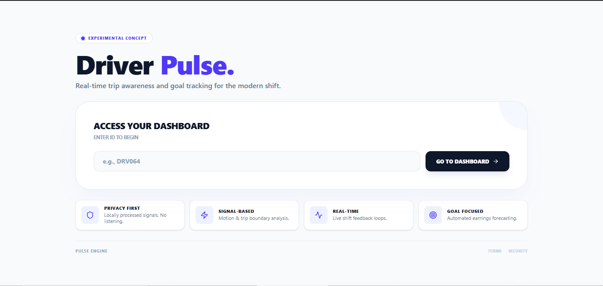
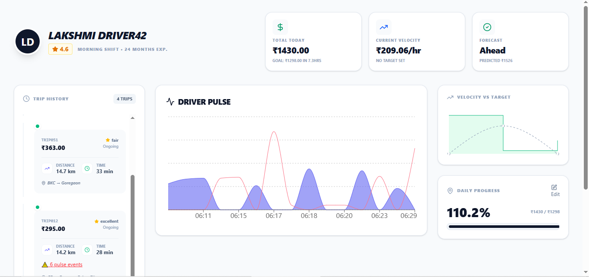

# ⚡ DrivePulse: Real-Time Driver Intelligence Dashboard

> **Empowering gig workers through data-driven well-being and earnings optimization.**

DrivePulse isn't just a tracker; it's a co-pilot. Built for the Uber Hackathon, it translates raw vehicle telemetry and environmental sensors into actionable insights for drivers.

---

## 🛠️ The Problem & Our Solution
Drivers often struggle with two things: **financial uncertainty** and **hidden stress**.
* **Problem**: Drivers don't know if they'll hit their goal until the shift is over.
* **Solution**: Our **Velocity Engine** calculates real-time earnings intensity (₹/hr) and forecasts outcomes before they happen.
* **Problem**: High-stress environments lead to fatigue and safety risks.
* **Solution**: The **Driver Pulse** monitor uses `audio_level_db` and `motion` sensors to visualize stress peaks in real-time.

---
## 📸 Visual Tour

### Main Landing Page of the website


### Driver Dashboard which is optimised for each driver


---

## 🪵 Project Logs
To see the detailed development timeline and how we tackled technical challenges (like the 500 API errors and time normalization), check out our [Development Log](./activity.log).

---

## 🚀 Key Features

### 1. Driver Pulse (Biometric & Environmental)
* **Real-time Stress Mapping**: Visualizes spikes in environmental noise and sudden vehicle motion.
* **Safety Score**: Aggregates sensor data to provide a "Safety: High" or "At Risk" status.

### 2. Financial Velocity Engine
* **Predictive Analytics**: Uses historical `trips.csv` data to compare current performance against targets.
* **Live Forecasting**: Tells the driver exactly how much they are predicted to earn by the end of their shift.

### 3. Dynamic Workflow
* **Trip Timeline**: A sleek, vertical history of all pickups and drop-offs with fare details.
* **On-the-Fly Adjustments**: Drivers can update goals instantly via a responsive modal.

---

## 🏗️ Architecture & Technical Specs

### Backend (FastAPI & Python)
* **Data Loader**: Handles complex CSV parsing and time-format normalization (HH:MM:SS).
* **Endpoints**: Robust API for driver profiles, trip history, and real-time progress.

### Frontend (React & TypeScript)
* **Visuals**: Powered by `Recharts` for smooth, animated data transitions.
* **UI/UX**: Clean, card-based glassmorphism design for high readability during driving.

---

## ⚙️ Installation & Setup

1. **Prerequisites**: Python 3.11+, Node.js 18+.
2. **Backend**:
   ```bash
   cd backend
   python -m venv venv
   source venv/bin/activate  # Or venv\Scripts\activate on Windows
   pip install -r requirements.txt
   uvicorn main:app --reload
### 3. Frontend Setup
```bash
cd frontend
npm install
npm run dev